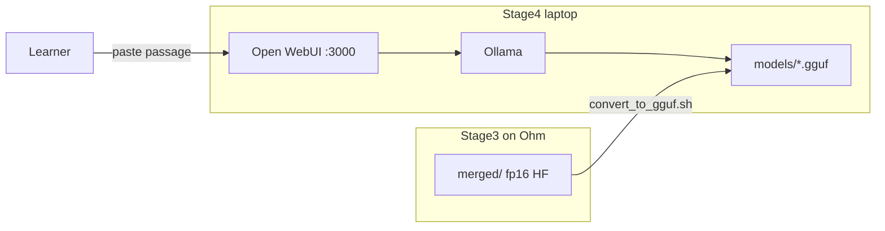

# Stage 4 — Open WebUI deployment (offline laptop)

Client-facing deliverable for the Edge SLM / Visagio project: run the
fine-tuned **Qwen2.5-3B** Databricks study-note model locally via **Ollama**
and **Open WebUI**, with no cloud API keys and no internet required at runtime.

```text
Stage 1  study_note_tasks.jsonl
   ↓
Stage 2  instruction_pairs (Alpaca JSONL) on Ohm
   ↓
Stage 3  QLoRA → adapter/ + merged/ (fp16 HF) on Ohm
   ↓
Stage 4  merged/ → GGUF → Ollama → Open WebUI  ← this folder
```

## Prerequisites

| Item | Notes |
|------|--------|
| Docker Desktop | For `docker compose` (Open WebUI + optional Ollama container) |
| Disk | ~4 GB free for the Q4_K_M GGUF (+ more during conversion) |
| RAM | 8+ GB recommended (CPU inference is slower but works) |
| Ollama | Host install *or* the `ollama` service in Compose |
| Stage 3 artifact | `training/outputs/qwen2.5-3b-lora/merged/` from Ohm |

## Architecture



**Inference mapping (must match training):**

| Training (Alpaca) | Deployed chat |
|-------------------|---------------|
| `instruction` | System prompt (`prompts/system_prompt.txt`) |
| `input` | User message (pasted docs/transcript chunk) |
| `output` | Model completion (study-note JSON) |

Paste **one passage** at a time (~120–700 words), matching Stage 1 chunk sizing.

---

## Artifact handoff from Ohm

1. On Ohm, after Stage 3 completes (with `merge_adapter: true`):

```text
training/outputs/qwen2.5-3b-lora/adapter/   # LoRA weights
training/outputs/qwen2.5-3b-lora/merged/    # fp16 HF — Stage 4 input
```

2. Copy `merged/` to your laptop (scp/rsync) next to this repo, e.g.:

```bash
mkdir -p ../training/outputs/qwen2.5-3b-lora
# scp -r ohm:.../merged ../training/outputs/qwen2.5-3b-lora/
```

3. If `merged/` is missing, merge locally (needs GPU/CPU + peft):

```bash
python scripts/merge_adapter.py \
  --adapter ../training/outputs/qwen2.5-3b-lora/adapter \
  --output ../training/outputs/qwen2.5-3b-lora/merged
```

Alternatively, receive a **pre-built** `models/databricks-study-notes-q4.gguf` and skip conversion.

---

## Build (GGUF + Ollama model)

From `deployment/`:

```bash
# 1. System prompt (aligned with Stage 1/2 via CONTENT_MARKER split)
python scripts/build_system_prompt.py

# Optional: verify against a Stage 2 Alpaca JSONL line
# python scripts/build_system_prompt.py --check path/to/instruction_pairs.eval.jsonl

# 2. Convert merged HF → quantized GGUF (default Q4_K_M)
./scripts/convert_to_gguf.sh \
  --merged ../training/outputs/qwen2.5-3b-lora/merged \
  --quant Q4_K_M

# Optional higher quality: --quant Q5_K_M

# 3. Register with Ollama (host ollama daemon)
./scripts/register_model.sh
# MODEL_NAME=databricks-study-notes by default
```

`convert_to_gguf.sh` clones a pinned `llama.cpp` into `.tools/llama.cpp` if needed
(gitignored). First conversion builds `llama-quantize` via CMake.

---

## Run (Open WebUI)

```bash
cp .env.example .env
docker compose up -d
open http://localhost:3000
```

Environment (see `.env.example`):

| Variable | Default | Purpose |
|----------|---------|---------|
| `MODEL_NAME` | `databricks-study-notes` | Default model in the UI |
| `WEBUI_PORT` | `3000` | Browser port |
| `OLLAMA_PORT` | `11434` | Ollama API |
| `OLLAMA_BASE_URL` | `http://host.docker.internal:11434` in `.env.example` | Open WebUI → Ollama; use `http://ollama:11434` for Compose-only Ollama |
| `WEBUI_AUTH` | `false` | Single-user laptop (no signup) |
| `HF_HUB_OFFLINE` | `1` (in Compose) | No HuggingFace calls at runtime |

### Registering the model inside Docker Ollama

If you use the Compose `ollama` service (not a host install):

```bash
# After GGUF exists under models/
docker compose up -d ollama
docker compose exec ollama \
  ollama create databricks-study-notes -f /models/../Modelfile
# Prefer host register_model.sh with OLLAMA_HOST pointing at the container,
# or copy Modelfile.generated and run create inside the container with
# FROM /models/databricks-study-notes-q4.gguf
```

**Apple Silicon / Option A tip:** run **host-native Ollama** (Metal) for better
speed. `.env.example` already sets:

```bash
OLLAMA_BASE_URL=http://host.docker.internal:11434
```

For a GGUF registered only inside the Compose `ollama` service, switch to:

```bash
OLLAMA_BASE_URL=http://ollama:11434
```

Then recreate Open WebUI so it picks up the env change:

```bash
docker compose up -d --force-recreate open-webui
```

---

## Use

1. Open `http://localhost:3000`
2. Select **`databricks-study-notes`** in the model picker
3. Paste a Databricks documentation or transcript passage
4. Expect **JSON only** with: `title`, `summary`, `key_concepts`,
   `important_features_or_tools`, `practical_workflow`,
   `common_mistakes_or_confusions`, `project_usage_notes`

Starter prompt (also in `openwebui/presets/databricks_study_notes.json`):

> Paste your Databricks documentation or transcript passage below (about 120–700 words). I will return structured study-note JSON only.

Responses are raw JSON in the chat pane (Open WebUI may render fenced blocks as markdown).

---

## Smoke test and holdout eval

```bash
# Requires Ollama + registered model
./scripts/smoke_test.sh

# Holdout / eval JSONL from Stage 2 (Alpaca records with input + output)
python eval/run_holdout_eval.py \
  --dataset path/to/instruction_pairs.eval.jsonl \
  --model databricks-study-notes \
  --split holdout \
  --min-valid-rate 0.80 \
  --output eval/report.json
```

Client handoff gate: **≥ 80% valid JSON** on holdout (`passed_gate` in `report.json`).

---

## Troubleshoot

| Symptom | Fix |
|---------|-----|
| Open WebUI: no models | Register GGUF (`register_model.sh`); confirm `OLLAMA_BASE_URL` reaches Ollama |
| Ollama unreachable from UI | On Mac/Windows use `host.docker.internal`; ensure port 11434 is published |
| OOM / killed during generate | Use `Q4_K_M`; close other apps; reduce `num_ctx` in Modelfile |
| Malformed JSON | Re-check system prompt (`build_system_prompt.py`); lower temperature; re-run holdout eval |
| Conversion fails | Ensure `merged/config.json` exists; install CMake + a C++ compiler for `llama-quantize` |
| Slow on CPU | Expected (~30–90s/response); prefer Metal (macOS Ollama) or NVIDIA GPU |

---

## Offline guarantee

- Compose sets `HF_HUB_OFFLINE=1` on Open WebUI
- Model weights are local GGUF files under `models/` (gitignored)
- No API keys required
- Pull Docker images **before** going offline: `docker compose pull`

---

## Layout

```text
deployment/
├── README.md                 # this file
├── docker-compose.yml
├── .env.example
├── Modelfile                 # template (register_model.sh refreshes)
├── prompts/
│   ├── study_notes_schema.py # vendored Stage 1 schema
│   └── system_prompt.txt     # built instruction (no chunk text)
├── scripts/
│   ├── build_system_prompt.py
│   ├── merge_adapter.py
│   ├── convert_to_gguf.sh
│   ├── register_model.sh
│   └── smoke_test.sh
├── eval/
│   ├── validate_response.py
│   └── run_holdout_eval.py
├── models/                   # *.gguf (gitignored)
└── openwebui/presets/
```

## What this stage does not include

- Re-training (Stage 3) or instruction-pair generation (Stage 2)
- Cloud hosting / TLS / multi-tenant auth
- Committing model weights to git
