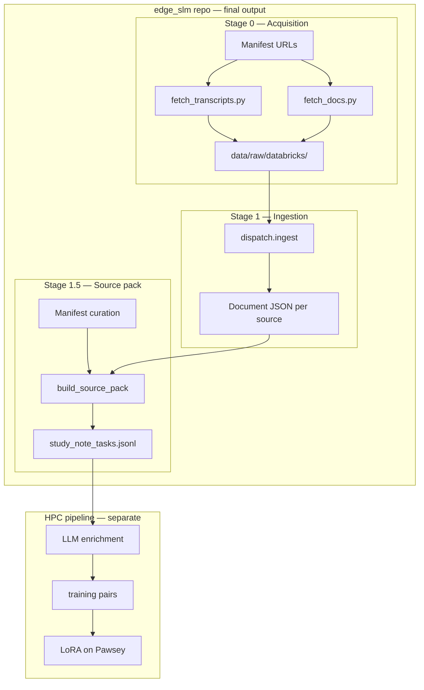

# Edge SLM — Databricks L&D Training Data Pipeline

**UWA AI Winter Project · Visagio SLM**  
**Client presentation · July 2026**

---

## 1. Goal

Build an **offline small language model (edge SLM)** that helps learners quickly understand **Databricks Data Engineering Foundations** — key concepts, tools, and practical workflows — without reading full documentation or watching long videos.

This repo prepares **study-note tasks** from curated sources. LLM enrichment and LoRA training run in a **separate HPC pipeline** on Pawsey.

---

## 2. Problem we solve

| Challenge | Our approach |
|---|---|
| Sources are heterogeneous (docs, videos, slides, articles) | One unified ingestion schema (`Document` / `Section`) |
| Content is too long for a small model at inference time | Chunk into ~450-word passages with full provenance |
| Quality training data needs structure and traceability | Each task carries prompt, schema, and full provenance |
| Dataset must be reproducible and auditable | Manifest-driven source pack; every task traces to URL + file |

---

## 3. Pipeline overview



**Data flow in one line:**

```text
source file → Document (sections) → TextChunk → study_note_tasks.jsonl
                                                      ↓
                                    (HPC pipeline: enrichment → LoRA)
```

---

## 4. What is built today

| Stage | Status | Deliverable |
|---|---|---|
| **0 — Acquisition** | Done | Download video audio + transcribe; export doc pages to Markdown |
| **1 — Ingestion** | Done | PDF, PPTX, Markdown, text, audio/video → shared schema |
| **1.5 — Source pack** | Done | Manifest → documents + **792 tasks** (`study_note_tasks.jsonl`) |

| Downstream (HPC pipeline) | Owner |
|---|---|
| LLM enrichment + training pairs | Pawsey HPC pipeline |
| LoRA fine-tuning | Pawsey HPC pipeline |

---

## 5. Current dataset: Databricks L&D Foundations

Built from [`data/manifests/databricks_ld_foundations.json`](../data/manifests/databricks_ld_foundations.json), aligned with the client's source-pack document.

| Metric | Value |
|---|---|
| Manifest sources | 428 total (**303** enabled after quality pass) |
| Successfully ingested | 303 |
| Disabled (deferred / thin / vendor deep-dives) | 125 |
| Total sections | 3,382 |
| Total source words | ~361,218 |
| Study-note tasks (chunks) | **792** |
| Train / eval / holdout | 678 / 86 / 28 |

**Resource mix (tasks by type):**

| Type | Tasks |
|---|---|
| Documentation | 696 |
| Video transcript | 87 |
| Tutorial | 5 |
| Training portal | 1 |
| Certification page | 1 |
| Article | 1 |
| Course outline | 1 |

**Output folder:**  
[`data/processed/source_packs/databricks_ld_foundations/`](../data/processed/source_packs/databricks_ld_foundations/)

| Artifact | Purpose |
|---|---|
| [`source_pack.json`](../data/processed/source_packs/databricks_ld_foundations/source_pack.json) | Pack index — counts, provenance, stats |
| `documents/*.json` | Full ingested documents (sections + metadata) |
| [`study_note_tasks.jsonl`](../data/processed/source_packs/databricks_ld_foundations/study_note_tasks.jsonl) | **Final deliverable** — one task per line |
| `manifest.normalized.json` | Validated manifest snapshot at build time |

---

## 6. Study-note task format (HPC handoff)

Each line in `study_note_tasks.jsonl` is a self-contained unit for downstream LLM enrichment:

| Field group | Examples |
|---|---|
| **Identity** | `task_id`, `source_id`, `source_title`, `original_url` |
| **Dataset labels** | `split` (train/eval), `topic_bucket_ids`, `resource_type` |
| **Provenance** | `chunk_id`, page/slide/time range, `source_section_indexes` |
| **Generation payload** | `prompt`, `source_content`, `expected_output_schema` |

- **`source_content`** — the passage text (typically ~450 words).
- **`prompt`** — full instructions plus schema and content.
- **`expected_output_schema`** — the JSON shape the LLM should return.

Every task is traceable back to the exact source URL and local file.

---

## 7. Target output — gold example

Reference fixture:  
[`data/manifests/examples/study_note_example_delta_streaming.json`](../data/manifests/examples/study_note_example_delta_streaming.json)

**Topic:** Delta Lake streaming reads and writes

Structured JSON includes:

- `title`, `summary`
- `key_concepts` — concept, simple explanation, why it matters
- `important_features_or_tools` — APIs, options, parameters
- `practical_workflow`, `common_mistakes_or_confusions`, `project_usage_notes`

The HPC pipeline validates LLM output against this schema. The gold example is a **whole-page summary**; tasks use **chunk-level** inputs (~450 words) for realistic passage summarization.

---

## 8. Walkthrough — Delta streaming documentation

| Step | Artifact |
|---|---|
| Source in manifest | `doc_delta_streaming` → [Microsoft Learn URL](https://learn.microsoft.com/en-us/azure/databricks/structured-streaming/delta-lake) |
| Local file | `data/raw/databricks/docs/delta_streaming.md` |
| Ingested document | `documents/doc_delta_streaming.json` |
| Chunked tasks | 8 tasks in `study_note_tasks.jsonl` |

**Inspect one task** (metadata + content, prompt omitted for readability):

```bash
PYTHONPATH=pipeline python -c "
import json

path = 'data/processed/source_packs/databricks_ld_foundations/study_note_tasks.jsonl'
for line in open(path):
    t = json.loads(line)
    if t['source_id'] == 'doc_delta_streaming' and t['chunk_index'] == 0:
        demo = {k: v for k, v in t.items() if k != 'prompt'}
        print(json.dumps(demo, indent=2, ensure_ascii=False))
        break
"
```

---

## 9. Supported input formats

| Format | Method |
|---|---|
| Documentation / articles | Markdown via `fetch_docs.py` (trafilatura) |
| YouTube / video | Transcript via yt-dlp + faster-whisper |
| PDF | pymupdf4llm; OCR for scanned pages; layout retry for print-to-PDF exports |
| PowerPoint | python-pptx — text, tables, speaker notes |
| Plain text / Markdown files | Direct ingestion |

Runs on **macOS and Windows** (Python environment + optional Tesseract / ffmpeg).

---

## 10. Topic buckets

Sources are tagged against six thematic buckets for filtering and reporting:

| ID | Label |
|---|---|
| `databricks_basics` | Workspace, notebooks, compute, jobs |
| `lakehouse_delta` | Delta Lake, ACID, time travel |
| `spark_sql_pyspark` | DataFrames, SQL, tables/views |
| `ingestion_incremental` | Structured Streaming, Auto Loader |
| `production_pipelines` | Lakeflow/DLT, jobs, orchestration |
| `governance_security` | Unity Catalog, permissions |

---

## 11. Quality and traceability

- Every task links to **original URL** and **local file path**
- Chunk metadata records **which sections/pages** contributed
- Manifest snapshot frozen at build time (`manifest.normalized.json`)
- Gold example test ensures output schema matches client reference

---

## 12. Next steps

| Step | Owner |
|---|---|
| HPC: LLM enrichment of **792** tasks | HPC pipeline |
| HPC: export training pairs + LoRA on Pawsey | HPC pipeline |
| Optional: deferred long transcripts (`video_cert_course` ~7.5h, Spark DE playlist) — not blocking | `fetch_transcripts.py` (local, when convenient) |
| Optional: re-discover / widen official docs if needed | `discover_databricks_docs.py` + rebuild |

**Rebuild the source pack** (after adding sources or changing chunk settings):

```bash
PYTHONPATH=pipeline python -c "
from ingestion.source_pack import build_source_pack
build_source_pack(
    'data/manifests/databricks_ld_foundations.json',
    'data/processed/source_packs/databricks_ld_foundations',
    skip_missing_files=True,
)
"
```

---

## 13. Summary

We have a **working, reproducible pipeline** from curated Databricks sources (plus official docs discovery and playlist expansion) to **792 handoff-ready tasks** in `study_note_tasks.jsonl`, with output shape defined by the **Delta streaming gold example**.

| Done (this repo) | Next (HPC pipeline) |
|---|---|
| Ingestion across formats | LLM enrichment |
| Manifest-driven source pack | Training-pair export |
| Chunked, provenance-rich tasks | LoRA fine-tuning on Pawsey |
