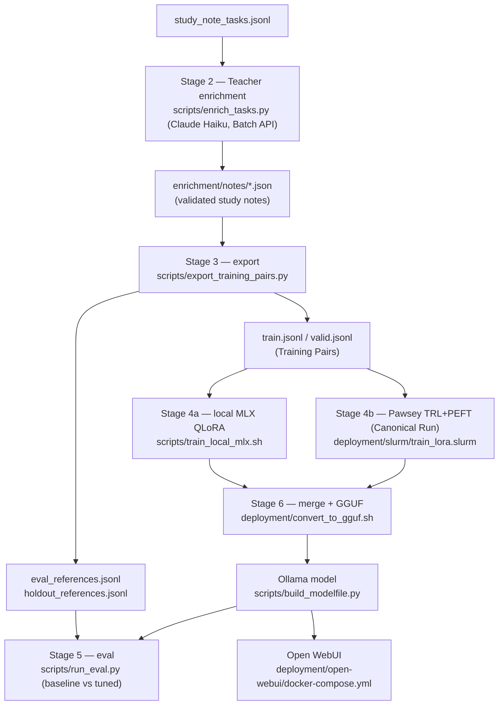

# Fine-tuning pipeline: enrichment → training → evaluation → deployment

Stages 2–6 of the Edge SLM pipeline. Stage 1 (ingestion → `study_note_tasks.jsonl`)
is documented in `docs/ingestion.md`. Vocabulary (Teacher, Student, Judge,
Canonical System Prompt, …) is defined in `CONTEXT.md`; key decisions in
`docs/adr/`.

## Overview



## Stage 2 — Teacher enrichment

Requires `pip install -r requirements-enrichment.txt` and `ANTHROPIC_API_KEY`.

```bash
# 1. Spot-check ~10 outputs with realtime calls before paying for the batch
PYTHONPATH=pipeline python scripts/enrich_tasks.py \
    data/processed/source_packs/databricks_ld_foundations/study_note_tasks.jsonl \
    data/processed/enrichment/databricks_ld_foundations \
    --sample 10

# 2. Full run through the Message Batches API (50% discount)
PYTHONPATH=pipeline python scripts/enrich_tasks.py \
    data/processed/source_packs/databricks_ld_foundations/study_note_tasks.jsonl \
    data/processed/enrichment/databricks_ld_foundations
```

Behaviour (see `pipeline/enrichment/`):

- Every response is validated against the study-note schema; failures get one
  retry with the validation errors fed back; persistent failures become
  Rejects in `rejects.jsonl` and are excluded.
- Resumable at task granularity — completed notes are never re-bought; an
  in-flight batch is picked up via `batch_state.json`.
- The run aborts if the reject rate exceeds 5% (`--reject-threshold`).

Expected cost for 792 tasks on Haiku via the Batch API: a few dollars.

## Stage 3 — Training-pair export

```bash
PYTHONPATH=pipeline python scripts/export_training_pairs.py \
    data/processed/source_packs/databricks_ld_foundations/study_note_tasks.jsonl \
    data/processed/enrichment/databricks_ld_foundations \
    data/processed/training/databricks_ld_foundations
```

Outputs:

| File | Contents |
|---|---|
| `train.jsonl`, `valid.jsonl` | Chat-format Training Pairs (train split only; `valid` is a deterministic 5% slice for training-time loss) |
| `eval_references.jsonl` | Teacher References for the eval split — never trained on |
| `holdout_references.jsonl` | Holdout references — spent once, at the very end |

Every pair uses the **Canonical System Prompt**
(`pipeline/training/canonical_prompt.py`) as its system message and the raw
chunk as the user message — never the verbose Teacher prompt (ADR 0001).

## Stage 4 — Fine-tuning (two Trainer Backends, ADR 0003)

The Student is **Qwen3-4B-Instruct** (ADR 0002). Both backends consume the
same `train.jsonl`/`valid.jsonl` and emit a LoRA adapter.

**Local (Apple Silicon, MLX)** — `pip install -r requirements-training-local.txt`:

```bash
scripts/train_local_mlx.sh \
    data/processed/training/databricks_ld_foundations \
    data/processed/adapters/databricks_ld_foundations_mlx
```

**Pawsey Setonix (TRL + PEFT, the Canonical Run)** — see the environment
setup comments in `deployment/slurm/train_lora.slurm`, then:

```bash
sbatch deployment/slurm/train_lora.slurm
```

### Recorded runs

| Run | Backend | Outcome |
|---|---|---|
| [2026-07-22 MLX `databricks_ld_foundations`](training_runs/2026-07-22_mlx_databricks_ld_foundations.md) | local MLX QLoRA | Completed; best val at iter **600** (0.757); final iter 1400 overfit (val 0.832). Development artifact only. |

## Stage 5 — Evaluation

Three tiers on `eval_references.jsonl`, always for both the Baseline
(untuned Student) and the fine-tuned model, served identically via Ollama:

1. **Structural** — JSON validity and schema conformance (free).
2. **Groundedness** — names the note claims (features, parameters, concepts)
   must appear in the source chunk (free, deterministic).
3. **Judge** — Claude Sonnet scores against the Teacher Reference
   (`--judge`, needs `ANTHROPIC_API_KEY`).

```bash
# Build and register the two models
PYTHONPATH=pipeline python scripts/build_modelfile.py \
    --from-ref qwen3:4b-instruct-2507 --output deployment/Modelfile.baseline
ollama create edge-slm-baseline -f deployment/Modelfile.baseline
# (tuned model: see Stage 6 below, then `ollama create edge-slm-study-notes ...`)

# Evaluate both, then compare
PYTHONPATH=pipeline python scripts/run_eval.py run \
    data/processed/training/databricks_ld_foundations/eval_references.jsonl \
    data/processed/eval/baseline --model edge-slm-baseline --judge
PYTHONPATH=pipeline python scripts/run_eval.py run \
    data/processed/training/databricks_ld_foundations/eval_references.jsonl \
    data/processed/eval/tuned --model edge-slm-study-notes --judge
PYTHONPATH=pipeline python scripts/run_eval.py compare \
    data/processed/eval/baseline/metrics.json data/processed/eval/tuned/metrics.json
```

**Holdout discipline:** `holdout_references.jsonl` is evaluated exactly once,
after all iteration is finished, to report final unbiased numbers.

## Stage 6 — Deployment (Ollama + Open WebUI)

```bash
# Merge the adapter and quantise (backend = mlx or trl)
deployment/convert_to_gguf.sh mlx \
    data/processed/adapters/databricks_ld_foundations_mlx \
    data/processed/gguf

# Generate the Modelfile (embeds the Canonical System Prompt) and register
PYTHONPATH=pipeline python scripts/build_modelfile.py \
    --from-ref data/processed/gguf/edge-slm-study-notes.Q4_K_M.gguf \
    --output deployment/Modelfile.study-notes
ollama create edge-slm-study-notes -f deployment/Modelfile.study-notes

# Open WebUI at http://localhost:3000
docker compose -f deployment/open-webui/docker-compose.yml up -d
```

The Deployed Model supports exactly one interaction: **paste Databricks
content, receive a structured study note**. Free-form Q&A is out of scope
for this phase (see CONTEXT.md).
