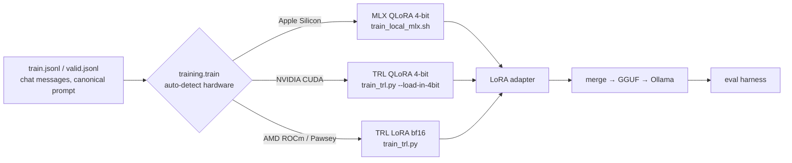
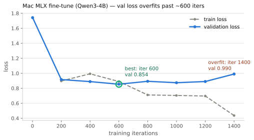

# Fine-tuning pipeline — one contract, runs everywhere

The same LoRA fine-tune of the Qwen3-4B student runs **locally on a Mac**, **locally on a
Windows/Linux NVIDIA laptop**, and **on HPC (Pawsey Setonix)** — from one data contract,
producing one adapter format that feeds one deploy + eval path. Local runs are the
development path; the Pawsey run is the canonical, deployed result (ADR 0003).



## Backend matrix

| Target | Hardware | Backend | Quant | Command |
| --- | --- | --- | --- | --- |
| **Mac** | Apple Silicon (Metal) | MLX `mlx_lm lora` | 4-bit | `scripts/train_local_mlx.sh` |
| **Windows / Linux** | NVIDIA dGPU (incl. ~8 GB laptops) | TRL + PEFT + bitsandbytes | 4-bit QLoRA | `scripts/train_local_windows.ps1` |
| **HPC (canonical)** | Pawsey Setonix, AMD MI250X | TRL + PEFT | bf16 LoRA | `deployment/slurm/train_lora.slurm` |

All three go through the unified dispatcher, or can be called directly.

## Shared data contract

Both backends consume the **identical** exported JSONL (`data/processed/training/.../{train,valid}.jsonl`)
— chat format, one object per line:

```json
{"messages": [
  {"role": "system", "content": "You turn Databricks learning content into structured study notes. ..."},
  {"role": "user", "content": "<source content>"},
  {"role": "assistant", "content": "<structured study notes>"}
]}
```

The system prompt is the canonical study-note prompt (pinned by `canonical_prompt_sha256` in
`export_summary.json`), so every backend trains on exactly the same objective.

## Run it

**Unified (auto-detects the machine):**
```bash
PYTHONPATH=pipeline python -m training.train \
  --data-dir data/processed/training/databricks_ld_foundations \
  --output-dir data/processed/adapters/run1
```
It prints which backend it chose and why, then runs it.

**Mac (explicit):**
```bash
pip install -r requirements-training-local.txt        # mlx-lm
scripts/train_local_mlx.sh \
  data/processed/training/databricks_ld_foundations \
  data/processed/adapters/databricks_ld_foundations_mlx
```

**Windows NVIDIA (explicit):**
```powershell
pip install torch --index-url https://download.pytorch.org/whl/cu124
pip install -r requirements-training-windows.txt
.\scripts\train_local_windows.ps1 `
  data\processed\training\databricks_ld_foundations `
  data\processed\adapters\databricks_ld_foundations_win
```

**HPC / Pawsey (canonical):**
```bash
# ROCm torch wheel + requirements-training-hpc.txt (see the SLURM header), then:
sbatch deployment/slurm/train_lora.slurm
```

## Presentation demo script

A tight 3-part live demo that tells the "runs everywhere" story:

1. **One contract** — show one `train.jsonl` line (system/user/assistant) and note both
   backends read it unchanged.
2. **Runs anywhere** — run the unified dispatcher on the **Mac** live; it prints
   `Apple Silicon detected -> MLX (Metal) QLoRA` and starts training. Show the same command's
   detection output captured on a **Windows NVIDIA** box (`-> TRL QLoRA 4-bit`) and the
   **Pawsey** SLURM submission (`-> TRL LoRA bf16`).
3. **One deploy + eval** — show the resulting adapter → merged GGUF → `ollama run` producing
   structured study notes, scored by the eval harness against the baseline.

Have a **pre-trained Mac adapter** ready (a full run takes a while) so step 3 is instant; kick
off the live Mac run in step 2 just to show it starting.

## Validated end-to-end on Mac (Qwen3-4B, repo dataset)

A real full run on the repo's 640-example Databricks dataset (M3 Max, ~407 tok/s, 5.5 GB
peak, ~1.9 h) confirms the local path — and surfaced a training finding:



**Validation loss bottoms at ~iter 600 (0.854) then overfits back to 0.990 by 1400**, while
train loss keeps falling (0.90 → 0.44). So `train_local_mlx.sh` now defaults to **600 iters**;
deploy the iter-600 checkpoint, not a longer run.

The full deploy chain that produced a running Ollama model (Qwen3 needs llama.cpp for GGUF —
`mlx_lm`'s GGUF export and Ollama's safetensors import don't yet support the arch):

```bash
# 1. fuse the best checkpoint and de-quantize to bf16 (standard HF safetensors)
python -m mlx_lm fuse --model mlx-community/Qwen3-4B-Instruct-2507-4bit \
  --adapter-path <best_iter600> --save-path fused_bf16 --dequantize
# 2. HF -> GGUF (llama.cpp supports Qwen3)
python llama.cpp/convert_hf_to_gguf.py fused_bf16 --outfile model.f16.gguf --outtype f16
# 3. import + quantize into Ollama (edge-sized ~2.5 GB)
ollama create edge-slm-databricks -q q4_K_M -f Modelfile   # FROM model.f16.gguf + SYSTEM prompt
# 4. run
ollama run edge-slm-databricks "Turn this into structured study notes: <content>"
```

The deployed model generates the structured study-note schema it was trained on.

## Notes / honesty

- **Canonical run:** adapters from different backends are not bit-identical (different
  kernels/quantization), so reported/deployed results come from the **Pawsey** run; local runs
  are for development and demos.
- **Windows VRAM:** QLoRA of a 4B model fits ~8 GB with `--batch-size 1 --grad-accum 16
  --max-seq-length 2048` (the `.ps1` defaults). A machine with **no NVIDIA GPU** can't train
  locally — use the Mac path or HPC.
- **Ohm vs Pawsey:** the earlier Ohm platform slides describe NVIDIA A100/CUDA; the canonical
  HPC target here is Pawsey Setonix (AMD/ROCm). Confirm which is the real deployment cluster
  before the canonical run.
