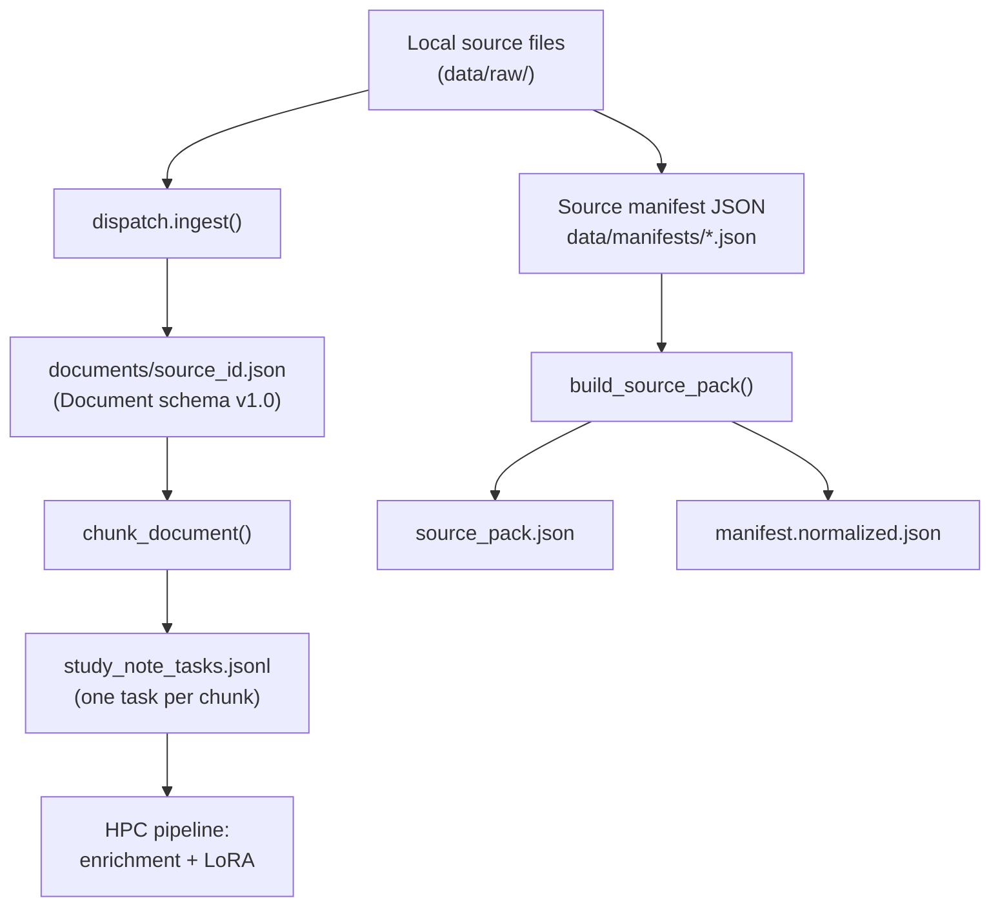

# Edge SLM — Project Status Report

**Repository:** [github.com/ksbtkv/edge_slm](https://github.com/ksbtkv/edge_slm)  
**Report date:** June 2026  
**Latest commit:** `6653427` — README and pipeline stages through source-pack chunking

---

## 1. Executive summary

The Edge SLM project is building an **offline, edge-deployable small language model** that helps learners understand technical content quickly — starting with **Databricks Data Engineering Foundations**.

The committed codebase delivers a **reproducible data preparation pipeline** that:

1. Ingests heterogeneous local sources (PDF, PPTX, text, Markdown, audio, video)
2. Normalises them into a single JSON `Document` contract
3. Curates sources via a manifest-driven **source pack**
4. Splits content into **model-sized chunks**
5. Emits **study_note generation tasks** — the final deliverable for the HPC pipeline

**What is done:** Stages 0–1.5 (ingestion, source pack, chunking) — pipeline ends at `study_note_tasks.jsonl`  
**What is next:** HPC pipeline — LLM enrichment, instruction-pair export, LoRA training (outside this repo)

---

## 2. Project objective


| Goal             | Description                                                                                            |
| ---------------- | ------------------------------------------------------------------------------------------------------ |
| Target use case  | Offline edge model that turns long tutorials, docs, and transcripts into structured learning summaries |
| First domain     | Databricks Data Engineering Foundations                                                                |
| First task type  | Documentation/transcript chunk → structured study notes (JSON)                                         |
| Design principle | Scriptable, repeatable, provenance-preserving pipeline suitable for future domains                     |


---

## 3. Pipeline status


| Stage                              | Status                | Deliverable                                          |
| ---------------------------------- | --------------------- | ---------------------------------------------------- |
| **0 — Model selection / hardware** | External to this repo | Report and model choice (referenced in project PDFs) |
| **1 — Ingestion**                  | **Complete**          | `Document` JSON per source file                      |
| **1.5 — Source pack + chunking**   | **Complete**          | Pack artifacts + `study_note_tasks.jsonl`            |
| **1.75 — Content acquisition**     | **Complete**          | Transcripts + doc exports under `data/raw/databricks/` |
| **2 — HPC enrichment + training**  | **Separate pipeline** | LLM responses, instruction pairs, LoRA on Pawsey       |


---

## 4. Data flow and JSON handoff points

The pipeline is a chain of **JSON-native artifacts**. Each stage reads the previous artefact and writes the next.




### Handoff summary


| Step               | Input                | Output            | Format | Location                                                        |
| ------------------ | -------------------- | ----------------- | ------ | --------------------------------------------------------------- |
| 1. Curate          | Client source list   | Source manifest   | JSON   | `data/manifests/databricks_ld_foundations.json`                 |
| 2. Ingest          | Local file path      | `Document`        | JSON   | `data/processed/source_packs/<pack>/documents/<source_id>.json` |
| 3. Index pack      | Manifest + documents | Pack index        | JSON   | `data/processed/source_packs/<pack>/source_pack.json`           |
| 4. Chunk + task    | `Document` sections  | Study-note tasks  | JSONL  | `data/processed/source_packs/<pack>/study_note_tasks.jsonl`     |
| 5. HPC (separate)  | Tasks JSONL          | Training pairs    | JSONL  | HPC pipeline on Pawsey                                          |


### Primary pipeline output (handoff to HPC)

The **main deliverable** of this repo is:

```text
data/processed/source_packs/<pack_id>/study_note_tasks.jsonl
```

Each line is one chunk-level task containing:

- `source_content` — model-sized input text
- `prompt` — full generation prompt (rules + expected output schema + content)
- `expected_output_schema` — target JSON shape for structured study notes
- Provenance: `source_id`, `chunk_id`, `topic_bucket_ids`, `split`, section/page/slide/time metadata

Downstream LLM enrichment and training-pair construction run in the **HPC pipeline** on Pawsey, not in this repository.

---

## 5. Code layout — the deliverable

```text
edge_slm/
├── README.md                          # Developer setup and usage
├── docs/
│   └── project_status_report.md       # This report
├── requirements*.txt                  # Core + optional format dependencies
├── pytest.ini
│
├── data/
│   ├── manifests/                     # Tracked: curated source manifests
│   │   ├── databricks_ld_foundations.json
│   │   └── examples/
│   │       └── study_note_example_delta_streaming.json  # Client gold example
│   ├── raw/                           # Gitignored: local source files
│   └── processed/                     # Gitignored: generated pack outputs
│
├── pipeline/
│   └── ingestion/
│       ├── schema.py                  # Document / Section contract
│       ├── serialize.py               # JSON save/load with version gate
│       ├── dispatch.py                # ingest(path) — format routing
│       ├── pdf_ingestor.py
│       ├── pptx_ingestor.py
│       ├── text_ingestor.py
│       ├── markdown_ingestor.py
│       ├── audio_video_ingestor.py
│       ├── chunking.py                # Model-sized chunking
│       ├── source_manifest.py         # Manifest validation
│       ├── source_pack.py             # Pack builder
│       └── study_notes_schema.py      # Prompt + output schema
│
└── tests/
    ├── test_ingestion_fast.py         # Schema, dispatch, text/md fixtures
    ├── test_ingestion_slow.py         # Real PDF/PPTX/audio/video (opt-in)
    ├── test_source_pack.py            # Manifest, pack build, chunking
    └── smoke_test_ingestion.py        # Human-readable end-to-end smoke test
```

### Module responsibilities


| Module                  | Role                                                         |
| ----------------------- | ------------------------------------------------------------ |
| `dispatch.py`           | Single entry point: `ingest(path) → Document`                |
| `schema.py`             | Locked typed contract between all stages                     |
| `serialize.py`          | Only sanctioned disk boundary for `Document` JSON            |
| `chunking.py`           | Sections → model-sized `TextChunk` records                   |
| `source_manifest.py`    | Validates curated source lists (IDs, buckets, splits, paths) |
| `source_pack.py`        | Orchestrates ingest + chunk + task emission for a manifest   |
| `study_notes_schema.py` | Databricks study-note prompt and target JSON schema          |


---

## 6. Contract and schema

### 6.1 Document schema (version `1.0`)

Every ingestor returns the same `Document` type. This is the **core contract** for the entire pipeline.

**Document** (required fields):


| Field            | Type          | Meaning                                           |
| ---------------- | ------------- | ------------------------------------------------- |
| `document_id`    | string        | Unique id, e.g. `pdf_a1b2c3d4`                    |
| `source_type`    | string        | `local_file`, `youtube_url`, `url`, `manual_text` |
| `source_path`    | string | null | Original file path                                |
| `modality`       | string        | `document`, `slides`, `audio`, `video`, `text`    |
| `content_type`   | string        | `pdf_text`, `slide_text`, `transcript`, etc.      |
| `ingestor`       | string        | Which module produced this document               |
| `method`         | string        | Extraction backend label                          |
| `sections`       | list          | Ordered list of `Section` objects                 |
| `schema_version` | string        | `"1.0"` — enforced on load                        |


**Section** (atomic structural unit):


| Field                         | Type          | Meaning                              |
| ----------------------------- | ------------- | ------------------------------------ |
| `index`                       | int           | 0-based position in document         |
| `text`                        | string        | Cleaned canonical content            |
| `raw_text`                    | string | null | Byte-faithful extraction original    |
| `heading`                     | string | null | Section or slide heading             |
| `page_number`                 | int | null    | PDF page (1-based)                   |
| `slide_number`                | int | null    | PPTX slide (1-based)                 |
| `start_time_s` / `end_time_s` | float | null  | Transcript segment timing            |
| `speaker`                     | string | null | ASR speaker label                    |
| `confidence`                  | float | null  | Extraction confidence                |
| `extraction_method`           | string | null | e.g. `pymupdf4llm`, `faster-whisper` |


**Design rule:** Sections are faithful source structure. Chunking is a separate downstream step and does not alter the `Document` schema.

### 6.2 Source manifest schema (version `1.0`)

Used to define a curated dataset pack. Checked-in starter:

`data/manifests/databricks_ld_foundations.json`


| Top-level field | Purpose                                         |
| --------------- | ----------------------------------------------- |
| `pack_id`       | Unique pack identifier                          |
| `domain`        | e.g. Databricks Data Engineering Foundations    |
| `topic_buckets` | Six thematic groupings for dataset organisation |
| `sources`       | List of curated sources with metadata           |


Each **source** record:


| Field              | Purpose                                               |
| ------------------ | ----------------------------------------------------- |
| `source_id`        | Stable identifier                                     |
| `title`            | Human-readable name                                   |
| `resource_type`    | `video_transcript`, `documentation`, `tutorial`, etc. |
| `original_url`     | Provenance URL (metadata only; no auto-fetch yet)     |
| `local_path`       | Path to curated local file/transcript                 |
| `topic_bucket_ids` | One or more topic tags                                |
| `split`            | `train`, `eval`, `holdout`, or `unassigned`           |
| `priority`         | Ingestion ordering                                    |
| `enabled`          | Whether to include in pack build                      |


### 6.3 Study-note task record (JSONL line)

One record per model-sized chunk in `study_note_tasks.jsonl`:


| Field                                              | Purpose                                     |
| -------------------------------------------------- | ------------------------------------------- |
| `task_id`                                          | Unique task identifier                      |
| `source_content`                                   | Chunk text fed to the generator             |
| `prompt`                                           | Full instruction including rules and schema |
| `expected_output_schema`                           | Target JSON structure                       |
| `chunk_id`, `chunk_index`, `chunk_word_count`      | Chunk metadata                              |
| `source_section_indexes`                           | Traceability back to document sections      |
| `source_headings`, `source_pages`, `source_slides` | Location provenance                         |
| `topic_bucket_ids`, `split`                        | Dataset organisation                        |
| `document_id`, `document_path`                     | Link to parent `Document` JSON              |


### 6.4 Target study-note output schema

The model is expected to produce JSON with:

- `title`, `summary`
- `key_concepts[]`
- `important_features_or_tools[]`
- `practical_workflow[]`
- `common_mistakes_or_confusions[]`
- `project_usage_notes[]`

Rules embedded in the prompt: **source-only**, beginner-friendly, preserve exact Databricks names, **JSON only** (no markdown wrapper).

---

## 7. Supported input formats


| Format     | Extensions                                               | Backend                 |
| ---------- | -------------------------------------------------------- | ----------------------- |
| PDF        | `.pdf`                                                   | pymupdf4llm             |
| PowerPoint | `.pptx`                                                  | python-pptx             |
| Plain text | `.txt`, `.text`                                          | stdlib                  |
| Markdown   | `.md`, `.markdown`                                       | stdlib                  |
| Audio      | `.mp3`, `.wav`, `.m4a`, `.flac`, `.aac`, `.ogg`, `.opus` | faster-whisper          |
| Video      | `.mp4`, `.mov`, `.mkv`, `.avi`, `.webm`                  | ffmpeg + faster-whisper |


Optional dependencies load lazily — the pipeline does not require all backends to be installed unless that format is used.

---

## 8. Chunking behaviour

Default configuration (`ChunkingConfig`):


| Parameter       | Default | Purpose                                                                 |
| --------------- | ------- | ----------------------------------------------------------------------- |
| `target_words`  | 450     | Preferred chunk size                                                    |
| `max_words`     | 700     | Hard upper bound before split                                           |
| `min_words`     | 120     | Minimum chunk size (undersized chunks merge or are dropped; sole short chunk kept) |
| `overlap_words` | 60      | Overlap between split chunks only                                       |


Behaviour:

- Normal sections → kept as one chunk
- Short adjacent sections → merged up to `target_words`
- Oversized sections → split at paragraph/sentence boundaries
- After merge/split, `_enforce_min_words` runs before overlap
- Provenance preserved: section indexes, headings, page/slide/time range

**Example (validated locally):** Edge SLM project PDF — 10 sections → 3 chunks (~490, 503, 275 words).

---

## 9. Databricks source pack — current state

The pack started from **15 curated sources** in the client's dataset source pack document (`databricks_ld_dataset_source_pack.docx`) and has been expanded with official docs discovery and playlist video expansion:

- Original curated mix: videos/playlists + documentation, tutorial, article, and certification pages
- **6 topic buckets** (basics, Delta Lake, Spark, ingestion, pipelines, governance)
- Auto-discovered `docs.databricks.com` pages (via `llms.txt` + capped sitemap seeding)
- Playlist parents expanded into per-video `video_transcript` children (`--expand-playlists`)

Every original curated `original_url` was verified against the source pack document. Discovered docs use cloud-agnostic `docs.databricks.com` URLs.

The client's worked example (Delta Lake streaming study notes, section 7 of the source pack document) is captured as a gold reference fixture at `data/manifests/examples/study_note_example_delta_streaming.json`. A test asserts it conforms to the study-note output schema for use by the HPC enrichment pipeline.

Content acquisition scripts:

- `scripts/discover_databricks_docs.py` — seed/merge official doc URLs from `llms.txt` (+ optional sitemap)
- `scripts/fetch_docs.py` — trafilatura Markdown export for documentation/article sources
- `scripts/fetch_transcripts.py` — yt-dlp + faster-whisper; `--expand-playlists` creates per-video transcript sources
- `scripts/audit_chunk_quality.py` — flag undersized study-note tasks after a pack build

Current pack build (local, gitignored): **792 study-note tasks** from **~361,218 source words** across **303 enabled/ingested sources** (manifest has 428 sources; missing/deferred videos, thin pages, and Lakeflow Connect vendor deep-dives are disabled) — well above the 500-chunk target. Chunk-quality audit flags **0** tasks below 120 words. Optional remaining coverage (deferred, not blocking): `video_cert_course` transcription (~7.5h) and remaining Spark DE playlist video transcripts.

Handoff snapshot: `data/processed/handoffs/databricks_ld_foundations_20260709/` (gitignored).

**Out of scope for this repo:** LLM enrichment, instruction-pair export, LoRA training (HPC pipeline).

---

## 10. Validation and quality assurance

Automated tests:

```bash
PYTHONPATH=pipeline pytest                    # fast suite
RUN_SLOW_INGESTION=1 PYTHONPATH=pipeline pytest  # full suite with real files
```

Coverage includes:

- Schema round-trip and version gate
- Dispatch routing for all registered extensions
- Manifest validation (duplicate IDs, unknown buckets, missing files)
- Source-pack build and chunk-based task emission
- Gold example fixture conformance to the study-note output schema
- Chunk split, merge, and provenance preservation
- Real-file ingestion for PDF, PPTX, audio, video (slow/opt-in)

Manual smoke test:

```bash
PYTHONPATH=pipeline python -m tests.smoke_test_ingestion
```

Validated locally on project fixtures: text, Markdown, PDF, PPTX, audio, and video all ingest and round-trip successfully.

---

## 11. What is tracked in git vs local only


| Path              | In git? | Contents                                |
| ----------------- | ------- | --------------------------------------- |
| `pipeline/`       | Yes     | All pipeline code                       |
| `tests/`          | Yes     | Test suite                              |
| `data/manifests/` | Yes     | Source manifests (small JSON)           |
| `data/raw/`       | No      | Large source files (PDFs, audio, video) |
| `data/processed/` | No      | Generated pack outputs                  |
| `outputs/`        | No      | Ad-hoc exports                          |


---

## 12. How to reproduce (developer)

```bash
conda activate edge-slm
cd edge_slm
pip install -r requirements-dev.txt
pip install -r requirements-ingestion-all.txt

# Run tests
PYTHONPATH=pipeline pytest
RUN_SLOW_INGESTION=1 PYTHONPATH=pipeline pytest

# Build Databricks pack (after enabling manifest sources)
PYTHONPATH=pipeline python -c "
from ingestion.source_pack import build_source_pack
build_source_pack(
    'data/manifests/databricks_ld_foundations.json',
    'data/processed/source_packs/databricks_ld_foundations',
    skip_missing_files=True,
)
"
```

---

## 13. Next steps

**This repo (optional, not blocking):**

1. Deferred long transcripts — `video_cert_course` (~7.5h whisper) and remaining Spark DE playlist videos via `fetch_transcripts.py`, then rebuild
2. Further docs discovery / curation if more coverage is desired

**HPC pipeline (separate):**

1. LLM enrichment of **792** tasks in `study_note_tasks.jsonl`
2. Instruction-pair export for LoRA fine-tuning
3. LoRA proof-of-concept on Pawsey

---

## 14. Summary for client


| Question                        | Answer                                                                                         |
| ------------------------------- | ---------------------------------------------------------------------------------------------- |
| Where are we?                   | Ingestion, source-pack curation, and chunking are implemented; **792** tasks ready for HPC     |
| What can the pipeline do today? | Turn local PDFs/docs/slides/audio/video into chunk-level study-note tasks with full provenance |
| What is the main output?        | `study_note_tasks.jsonl` — final deliverable; handoff to HPC pipeline                          |
| What is blocked on content?     | Nothing blocking — 500+ chunk target met; long cert/Spark DE transcripts deferred as optional  |
| What comes next?                | HPC pipeline: LLM enrichment of 792 tasks, training pairs, LoRA on Pawsey                      |


