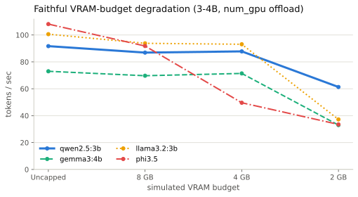
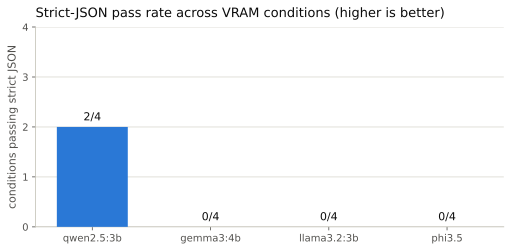
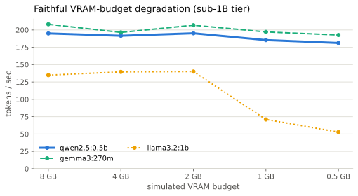

# Stage 0 — Model selection & VRAM validation (Apple M3 Max)

**Scope:** a multi-condition Stage 0 study — uncapped baseline, a faithful VRAM-budget
sweep (8/4/2 GB via `num_gpu` offload), a full-response quality audit, and a sub-1B
parameter-size sweep. Produced with the reusable harness in `sandbox/`.
**Machine:** Apple M3 Max (`gpu,t6031`, 40-core GPU), 48 GB unified memory, macOS.
**Runtime:** Ollama 0.30.10 native (Metal), Q4 GGUF, temp 0.1, num_predict 256.
**Harness:** `sandbox/harness/stage0_bench.py`. Charts regenerate via `charts/make_charts.py`.
**Two constraint methods were tried.** The **`num_gpu`-offload** method (§2) is canonical —
it reproduces how a real VRAM-limited GPU behaves. An earlier **`iogpu.wired_limit_mb`** cap
method over-reports failures and is **superseded**; it is kept only as a methodology note in
[Appendix B](#appendix-b--superseded-wired-limit-cap-method). Do not draw conclusions from
Appendix B's numbers.

---

## Summary of findings

**Recommendation: `qwen2.5:3b` (Q4_K_M) as the primary model — confirmed.** This M3 Max
study, with the team's earlier base-M3 (Ollama) and Windows RTX 2070 (LM Studio) runs, gives
three independent Stage 0 evaluations that all converge on `qwen2.5:3b`.

1. **VRAM headroom is the gating metric, and qwen wins it.** qwen wires only ~2.6 GB and
   stays fully GPU-resident at full speed down to a 4 GB budget. Under faithful `num_gpu`
   offload (§2) *all four models run* at every budget down to 2 GB — a real GPU offloads
   gracefully rather than failing — but **qwen degrades the least**: at 2 GB it keeps 28/36
   layers on GPU and leads throughput (61 vs 33–37 tok/s), because it is the smallest.
   phi3.5 is the first to need offload (largest, ~8.5 GB).

2. **Raw speed is hardware-specific and must not drive the choice.** Uncapped, the M3 Max
   ranks phi3.5 (108) ≳ llama (101) > qwen (92) > gemma (73) tok/s — the *reverse* of the
   base-M3 ranking. tokens/sec does not transfer between GPUs; the VRAM-capacity ranking does.

3. **Strict-JSON reliability separates qwen — though imperfectly.** In the full-response
   quality audit (§3), `qwen2.5:3b` is the only 3–4B model to pass strict JSON at all
   (2/4 conditions); gemma, llama, phi, and every sub-1B model score 0/4. Strict JSON is
   central to Stage 2, so the pipeline must validate JSON and retry/repair even with qwen.

4. **The size spectrum brackets the decision** (§3, §4):

   | Tier | VRAM problem? | Quality problem? |
   | ---- | ------------- | ---------------- |
   | sub-1B (qwen 0.5b / gemma 270m / llama 1b) | ✅ solved — fits any GPU, 2–3× faster | ❌ all fail strict-JSON; qwen-0.5b drifts to Chinese |
   | **qwen2.5:3b (chosen)** | ✅ fits to 4 GB | best strict-JSON result (2/4), needs validation/retry |
   | 4B+ (gemma 4b / phi 3.8b) | ❌ phi needs >8 GB | mixed |

   Going smaller solves the hardware constraint but breaks the quality requirement; 3B is the
   sweet spot that clears both bars.

5. **Quality degrades more from shrinking parameters than from shrinking VRAM.** With faithful
   offload, every model produces non-empty output at every budget — lower VRAM mainly costs
   throughput. Lower parameter count keeps speed/fit but regresses structured output
   (`qwen2.5:0.5b`: 0/4 strict JSON, Chinese drift in 3/4 conditions).

**Caveats — don't over-read the numbers:**
- **Speed is M3-Max-specific** and does not transfer to a discrete GPU (different cores /
  bandwidth). Only the VRAM *capacity / headroom ranking* transfers.
- **Absolute system RAM/swap was inflated** by other running apps; trust Model VRAM
  (Ollama `size_vram`) and tok/s as the clean signals.
- **Method:** the canonical numbers are the `num_gpu` sweep (§2). The `iogpu.wired_limit_mb`
  cap ([Appendix B](#appendix-b--superseded-wired-limit-cap-method)) over-reports failures —
  ignore its numbers for decisions.
- **phi3.5's 8.5 GB** is mostly KV cache from a large default context; a smaller `num_ctx`
  would shrink it. Worth testing before fully disqualifying phi on a ≥8 GB card.
- **Still outstanding:** no run yet on the true deployment target (16 GB RAM + discrete
  NVIDIA GPU on Windows). The sandbox's Docker CUDA mode is built to capture it on real hardware.

---

## 1. Uncapped baseline (all four, fully GPU-resident)

| Model | tok/s (mean) | Model VRAM (GB)¹ | Peak GPU mem (MB)² | Load footprint (GB)³ | Strict JSON⁴ | 5-bullet format |
| ----------- | :----------: | :--------------: | :----------------: | :------------------: | :----------: | :-------------: |
| qwen2.5:3b  |     91.7     |     **2.60**     |       5 010        |        1.89          | ✅ parses    | ⚠️ dash on own line |
| gemma3:4b   |     73.0     |       3.54       |       6 907        |        4.07          | ❌ md fence  | ✅ clean |
| llama3.2:3b |    100.6     |       3.92       |       6 145        |        2.95          | ❌ parse fail | ❌ `- -` doubled |
| phi3.5      |   **108.1**  |     **8.53**     |      11 099        |        5.49          | ❌ md fence  | ✅ clean |

¹ Ollama `size_vram` — model weights + KV cache wired to the GPU.
² `IOAccelerator` "In use system memory" peak via `ioreg` (system-wide GPU mem).
³ Used-memory delta from baseline; absolute system RAM was environment-inflated, not a clean signal.
⁴ Deterministic strict-JSON parse (matches the §3 audit). Per-prompt tok/s was stable (±3),
so the means are reliable.

**Read:** phi3.5 is fastest but needs the most VRAM (8.5 GB); qwen is mid-pack on speed but
lightest (2.6 GB) and the only clean JSON emitter. Speed and VRAM pull in opposite directions —
the constrained sweeps below decide it.

---

## 2. Faithful VRAM-budget sweep (`num_gpu` offload) — canonical

Sets Ollama's `num_gpu` per model so surplus layers offload to CPU — the *supported*
mechanism a real VRAM-limited GPU triggers. For each model the harness measured the full GPU
footprint and layer count, mapped each budget to a layer count, and reran. Labels:
`metal-budget{8,4,2}`. **All runs produced 5/5 non-empty responses** (no failures anywhere).

**Tokens/sec — and (layers kept on GPU):**

| Model | 8 GB | 4 GB | 2 GB |
| ----------- | :------------: | :------------: | :------------: |
| qwen2.5:3b  | 86.9 (36/36)   | 87.8 (36/36)   | **61.3 (28/36)** |
| gemma3:4b   | 69.7 (34/34)   | 71.4 (34/34)   | 33.0 (19/34)   |
| llama3.2:3b | 93.8 (28/28)   | 93.1 (28/28)   | 37.2 (14/28)   |
| phi3.5      | 91.8 (30/32)   | 49.6 (15/32)   | 33.5 (8/32)    |

**The reading:** down to a 2 GB budget, *all four models run* — they offload gracefully, not
catastrophically. The differentiator is **how gracefully each degrades**, and qwen wins it: at
2 GB it keeps the most layers on GPU (28/36 ≈ 78%) and the highest throughput (61 vs 33–37),
because it is the smallest. phi3.5 is first to spill (already 2 layers off at 8 GB). The
selection holds on "degrades most gracefully / stays fastest under constraint."

> The earlier wired-limit method reported qwen as the *only* model that runs at 4 GB and
> showed phi "collapsing" at 8 GB. Both are artifacts — the faithful numbers above supersede
> them. See [Appendix B](#appendix-b--superseded-wired-limit-cap-method).

---

## 3. Quality audit: VRAM budget vs parameter size

A full-response rerun (complete responses stored, not 200-char previews) with deterministic,
parser-oriented checks: non-empty; exactly five dash bullets; strict JSON parse with exactly
two `{instruction, response}` objects; grounded-answer keyword check; policy/procedure
sentence count; honest-unknown check; markdown-fence and CJK-drift detection. These approximate
whether the pipeline can consume the output automatically. Labels: `metal-quality-*`,
`metal-small-quality-*`.

### A. Decreasing VRAM budget: speed drops, output stays non-empty

Using faithful `num_gpu` offload, every 3–4B model produced full responses in every condition.
Lower VRAM mainly cost throughput; structured-output reliability is model-specific and
somewhat run-variable, but never turns into the empty-output failure of the wired-limit method.

| Model | Quality-check passes¹ | Non-empty | Strict JSON pass² | Exact 5 bullets | tok/s uncapped → 2 GB | Speed change |
| ----------- | :------------------: | :-------: | :---------------: | :-------------: | :-------------------: | :----------: |
| qwen2.5:3b | 8/20 | 20/20 | **2/4** | 0/4 | 91.9 → 43.7 | −52% |
| gemma3:4b | 16/20 | 20/20 | 0/4 | **4/4** | 74.7 → 23.1 | −69% |
| llama3.2:3b | 12/20 | 20/20 | 0/4 | **4/4** | 97.2 → 27.4 | −72% |
| phi3.5 | 7/20 | 20/20 | 0/4 | 1/4 | 102.1 → 26.7 | −74% |

¹ Five deterministic checks per condition × four conditions = 20.
² Strict JSON counted across uncapped, 8 GB, 4 GB, 2 GB full-response runs.

Nuance: `qwen2.5:3b` passed strict JSON uncapped and at 8 GB but failed at 4 GB and 2 GB.
The 4 GB case is still fully GPU-resident (`36/36` layers), so read this as structured-output
fragility / run variation, not VRAM directly damaging semantics. Practical takeaway: qwen is
the only strong candidate that passes strict JSON at all, but Stage 2 must validate + retry/repair.

### B. Decreasing parameter size: structured output gets worse despite easy fit

The small-tier models fit easily and stay fast, but the audit shows speed comes with weaker
output discipline.

| Family | Strong model strict JSON | Small model strict JSON | Small model CJK drift | Quality passes: strong → small | tok/s: strong → small | Speed change |
| ------ | :----------------------: | :---------------------: | :-------------------: | :----------------------------: | :-------------------: | :----------: |
| qwen | **2/4** (`qwen2.5:3b`) | 0/4 (`qwen2.5:0.5b`) | **3/4** | 8/20 → 6/20 | 91.9 → 220.2 | +140% |
| gemma | 0/4 (`gemma3:4b`) | 0/4 (`gemma3:270m`) | 0/4 | 16/20 → 8/20 | 74.7 → 216.0 | +189% |
| llama | 0/4 (`llama3.2:3b`) | 0/4 (`llama3.2:1b`) | 0/4 | 12/20 → 8/20 | 97.2 → 157.1 | +62% |
| phi | 0/4 (`phi3.5`) | N/A | N/A | N/A | No smaller Ollama variant | N/A |

All three small-tier models produced 20/20 non-empty responses and stayed fully GPU-resident
even at a 2 GB budget. Their failure mode is not hardware fit; it is structured-output
competence. The qwen family shows the tradeoff clearest: `qwen2.5:0.5b` is ~2.4× faster than
`qwen2.5:3b` but drops from 2/4 to 0/4 strict-JSON and drifts into Chinese in 3/4 conditions.

**Conclusion:** VRAM reduction and parameter reduction fail differently. Lower VRAM (handled
with `num_gpu`) mainly reduces speed. Lower parameter count keeps speed/fit but damages
structured output. `qwen2.5:3b` is the best compromise — the only model that ever passes
strict JSON while still fitting low-end VRAM — but treat raw model JSON as untrusted.

---

## 4. Appendix — Small-tier sweep (sub-1B / smallest-of-family)

Smallest available model per family under the same conditions. Only qwen2.5 ships a true 0.5B;
gemma's smallest is 270m (0.27B), llama's is 1b, phi3.5 has no variant below 3.8B (excluded).
Labels: `metal-small-*`.

**Faithful `num_gpu` budget curve (tok/s and layers-on-GPU), extended to 1 / 0.5 GB** to find
where these tiny models actually start offloading:

| Model | 8 GB | 4 GB | 2 GB | 1 GB | 0.5 GB |
| --------------- | :----------: | :----------: | :----------: | :----------: | :----------: |
| qwen2.5:0.5b | 195 (24/24) | 192 (24/24) | 195 (24/24) | 185 (24/24) | 181 (17/24) |
| gemma3:270m | 208 (18/18) | 197 (18/18) | 207 (18/18) | 197 (18/18) | 193 (18/18) |
| llama3.2:1b | 135 (16/16) | 140 (16/16) | 140 (16/16) | **71 (8/16)** | **53 (4/16)** |

**Model VRAM (GB):** qwen2.5:0.5b 0.69 · gemma3:270m 0.38 · llama3.2:1b 1.93.

All runs produced 5/5 non-empty responses at every budget — including 0.5 GB. The curve:
- **gemma3:270m** (0.38 GB): never offloads, full speed even at 0.5 GB — effectively VRAM-free.
- **qwen2.5:0.5b** (0.69 GB): full through 1 GB; offloads 7/24 layers at 0.5 GB yet barely
  slows (181 tok/s) — still ~2× the 3B tier's uncapped speed.
- **llama3.2:1b** (1.93 GB): the only one that meaningfully degrades — halves at 1 GB
  (71 tok/s) and ~53 tok/s at 0.5 GB, but still produces full working output.

**Conclusion:** memory is a non-issue sub-1B (all three run even at 0.5 GB), but quality is the
disqualifier — all three score 0/4 strict JSON and qwen-0.5b drifts into Chinese (3/4). Going
smaller solves hardware and breaks quality; `qwen2.5:3b` remains the sweet spot.

---

## Appendix A — Reproducibility

Every number above comes from `sandbox/harness/stage0_bench.py` against native Ollama, one
model resident at a time (evict → baseline → load → 5-prompt set, memory sampled at 10 Hz).
Raw per-run data is in `sandbox/results/<label>/results.json`; charts regenerate from it via
`python charts/make_charts.py`. Faithful budgets use `--vram-budget-gb`; the quality audit uses
`--save-responses`. The five prompts probe the capabilities that gate the pipeline: 5-bullet
formatting, grounded answering, strict-JSON instruction-pair generation, policy-vs-procedure
explanation, and honest-unknown calibration.

## Appendix B — Superseded: wired-limit cap method

> ⚠️ **The numbers in this appendix over-report failures and must not be used for conclusions.**
> They are retained only to document the methodology dead-end. The canonical results are §2.

The first VRAM-constraint attempt set `sudo sysctl iogpu.wired_limit_mb` to bound GPU-wired
unified memory. **It produces empty output under constraint**, which looks like catastrophic
model failure but is a method artifact:

| Model | Uncapped | 8 GB | 4 GB | 2 GB |
| ----------- | :------: | :--: | :--: | :--: |
| qwen2.5:3b | 91.7 | 99.0 | 100.1 | empty |
| gemma3:4b | 73.0 | 78.9 | empty | 22.7 |
| llama3.2:3b | 100.6 | 109.1 | **9.9** | empty |
| phi3.5 | 108.1 | **9.2** | ~20 | empty |

**Why it's wrong:** `iogpu.wired_limit_mb` caps wired memory but does **not** tell Ollama's
offload planner to use fewer layers. Ollama still sees the full 48 GB unified pool, over-commits
layers to the GPU, then fails to allocate working memory at runtime and emits nothing. A model
is fine when it either fully fits on GPU or falls back to ~pure CPU; it breaks in the awkward
hybrid between. The fix is to drive the offload planner directly (`num_gpu`) — that is §2, where
every one of these "failures" instead runs at 33–61 tok/s.

Conclusions that were drawn from these numbers (e.g. "only qwen runs at 4 GB", "4 GB is the
lower bound") are **withdrawn** and replaced by §2. (The cap knob remains genuinely useful for
*capacity* checks — "does the model's footprint fit in N GB?" — just not for throughput or
pass/fail of generation.)
